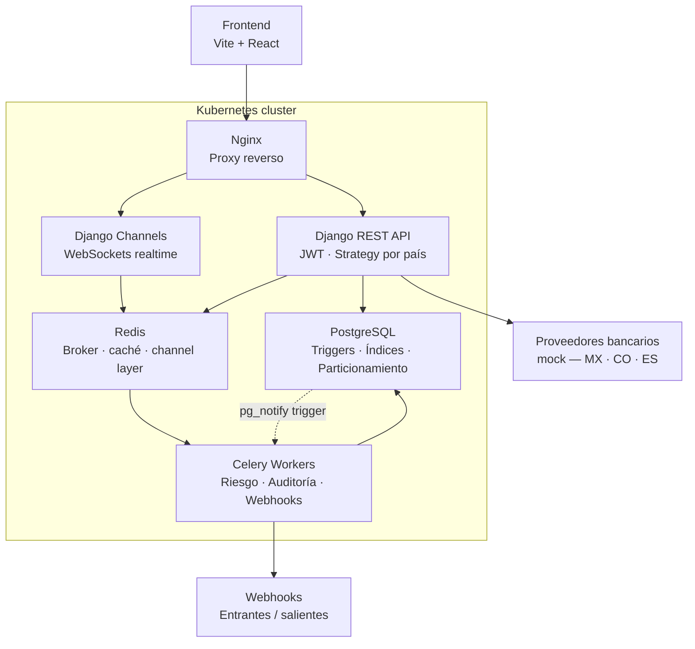

# Arquitectura — Fintech Multipaís (Bravo)

## Flujo principal

1. El usuario crea una solicitud desde el **Frontend**
2. **Nginx** enruta la petición a **Django REST API** o a **Django Channels** (WebSocket)
3. Django valida JWT, aplica el **Strategy** del país correspondiente y llama al **Proveedor bancario mock**
4. La solicitud se persiste en **PostgreSQL**; un trigger `AFTER INSERT` emite `pg_notify`
5. **Celery** recoge el evento, ejecuta evaluación de riesgo y auditoría en segundo plano
6. Al cambiar el estado, Celery notifica al **channel layer de Redis**
7. **Django Channels** emite el cambio vía WebSocket al frontend en tiempo real
8. Si aplica, Celery envía o recibe un **Webhook** del proveedor externo

## Stack

| Capa | Tecnología |
|---|---|
| Frontend | Vite + React + WebSocket nativo |
| Proxy | Nginx |
| API | Django + Django REST Framework |
| Realtime | Django Channels + Redis channel layer |
| Async | Celery + Redis (broker) |
| Caché | Redis |
| Base de datos | PostgreSQL |
| Despliegue | Kubernetes (manifiestos YAML) |
| Tareas | Makefile |