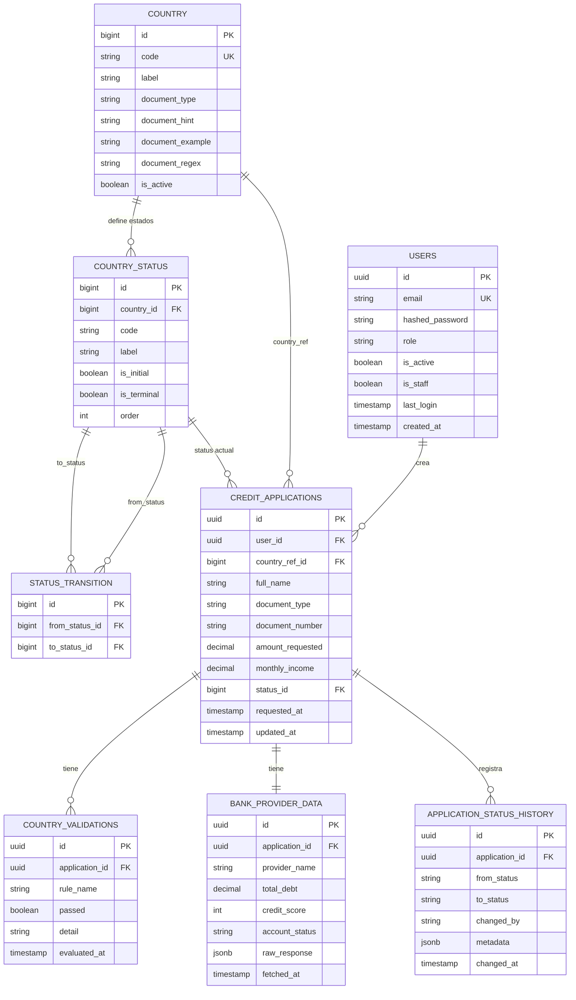

# Modelo de datos — Fintech Multipaís (Bravo)

## ERD



---

## Descripción de tablas

### `users`
Usuarios del sistema autenticado. El campo `role` soporta autorización básica (`user`, `admin`) y se complementa con flags de Django (`is_active`, `is_staff`).

### `country`
Catálogo de países habilitados para originación de crédito. Contiene reglas de documento por país (`document_type`, `document_regex`, `document_hint`) y estado de activación.

### `country_status`
Estados de solicitud configurados por país. Cada estado tiene código, etiqueta, orden de presentación y flags de estado inicial/terminal.

### `status_transition`
Transiciones permitidas entre estados (`from_status` -> `to_status`) dentro del mismo país. Es la fuente de verdad de la máquina de estados DB-driven.

### `credit_applications`
Tabla central del sistema. La solicitud referencia país mediante `country_ref_id` y estado actual mediante `status_id`.

**Estados vigentes por flujo (ejemplo):**
`created|pending` → `fetching_bank_data` → `validate_country_rules` → `approved|rejected` (con salida técnica a `technical_error`).

### `country_validations`
Registro de cada regla evaluada por país. Una aplicación puede tener múltiples filas aquí, una por regla (ej: `curp_format`, `income_ratio`, `document_exists`). Permite auditar exactamente qué regla falló.

### `bank_provider_data`
Respuesta del proveedor bancario mock por país. El campo `raw_response` en `jsonb` almacena la respuesta completa sin normalizar, ya que cada proveedor devuelve campos distintos (CO retorna `total_debt`, BR retorna `credit_score`, etc.).

### `application_status_history`
Historial completo de transiciones de estado. Cada cambio genera una fila nueva con `metadata` en JSON para trazabilidad técnica (task, evento, razón de fallo, etc.).

---

## Índices recomendados

```sql
-- Consultas frecuentes por país y estado FK
CREATE INDEX idx_applications_country_status ON credit_applications (country_ref_id, status_id);

-- Listados paginados por fecha
CREATE INDEX idx_applications_requested_at ON credit_applications (requested_at DESC);

-- Lookup por documento por país
CREATE INDEX idx_applications_document ON credit_applications (country_ref_id, document_number);

-- Historial de una aplicación
CREATE INDEX idx_status_history_application ON application_status_history (application_id, changed_at DESC);

-- Estado actual por país (catálogo)
CREATE INDEX idx_country_status_country_order ON country_status (country_id, "order");
```

---

## Notas de evolución

El modelo evolucionó desde estados y país como strings en `credit_applications` a un diseño normalizado:

1. `country` migró a `country_ref` (FK a `country`).
2. `status` migró a FK a `country_status`.
3. Se introdujo `status_transition` como definición DB-driven de transiciones permitidas.
4. `application_status_history` añadió `metadata` y aumentó longitud de `from_status`/`to_status` para códigos largos de estado.