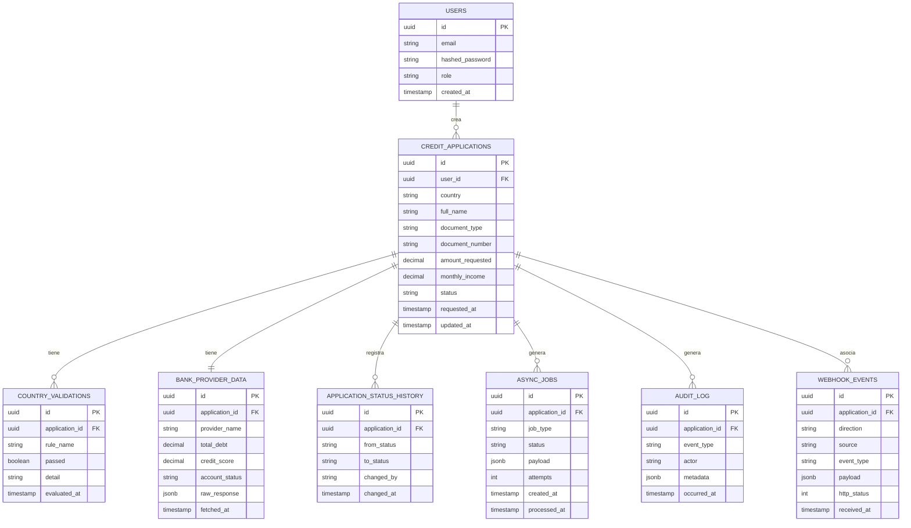

# Modelo de datos — Fintech Multipaís (Bravo)

## ERD



---

## Descripción de tablas

### `users`
Usuarios del sistema (operadores o agentes). El campo `role` soporta autorización básica (`admin`, `agent`, `readonly`).

### `credit_applications`
Tabla central del sistema. El campo `country` actúa como discriminador para aplicar el Strategy correcto en validaciones y proveedores. El campo `status` representa el estado actual dentro del flujo del país correspondiente.

**Estados posibles (ejemplo MX):**
`pending` → `validating` → `approved` | `rejected` | `under_review`

### `country_validations`
Registro de cada regla evaluada por país. Una aplicación puede tener múltiples filas aquí, una por regla (ej: `curp_format`, `income_ratio`, `document_exists`). Permite auditar exactamente qué regla falló.

### `bank_provider_data`
Respuesta del proveedor bancario mock por país. El campo `raw_response` en `jsonb` almacena la respuesta completa sin normalizar, ya que cada proveedor devuelve campos distintos (CO retorna `total_debt`, BR retorna `credit_score`, etc.).

### `application_status_history`
Historial completo de transiciones de estado. Cada cambio genera una fila nueva. Permite auditar el ciclo de vida completo de una solicitud y disparar lógica adicional (notificaciones, reevaluaciones).

### `async_jobs`
Cola de trabajos persistida en base de datos. El trigger de PostgreSQL inserta aquí al crear una `credit_application`. Celery lee y procesa estas filas. El campo `attempts` permite reintentos con backoff.

### `audit_log`
Log estructurado de eventos relevantes del negocio: creación, cambios de estado, webhooks recibidos, fallos de proveedor. Separado del historial de estados para no mezclar trazabilidad técnica con flujo de negocio.

### `webhook_events`
Registro de todos los webhooks entrantes y salientes. El campo `direction` puede ser `inbound` (proveedor notifica al sistema) o `outbound` (sistema notifica a externo). Permite depurar flujos asíncronos.

---

## Índices recomendados

```sql
-- Consultas frecuentes por país y estado
CREATE INDEX idx_applications_country_status ON credit_applications (country, status);

-- Listados paginados por fecha
CREATE INDEX idx_applications_requested_at ON credit_applications (requested_at DESC);

-- Lookup por documento (unicidad eventual por país)
CREATE INDEX idx_applications_document ON credit_applications (country, document_number);

-- Jobs pendientes (Celery polling)
CREATE INDEX idx_jobs_status_created ON async_jobs (status, created_at)
    WHERE status = 'pending';

-- Historial de una aplicación
CREATE INDEX idx_status_history_application ON application_status_history (application_id, changed_at DESC);

-- Auditoría por aplicación
CREATE INDEX idx_audit_application ON audit_log (application_id, occurred_at DESC);
```

---

## Estrategia de escalabilidad

Para millones de solicitudes, `credit_applications` se particiona por `country` (partition by list) y por rango de `requested_at` (partition by range por año/mes). Esto mantiene las particiones activas pequeñas y permite archivar o comprimir particiones históricas sin afectar el sistema en producción.

```sql
CREATE TABLE credit_applications (...)
    PARTITION BY LIST (country);

CREATE TABLE credit_applications_mx PARTITION OF credit_applications
    FOR VALUES IN ('MX');

CREATE TABLE credit_applications_co PARTITION OF credit_applications
    FOR VALUES IN ('CO');
```

Las tablas de auditoría (`audit_log`, `application_status_history`, `webhook_events`) crecen sin límite — se archivan a almacenamiento frío (S3 / Glacier) pasados 90 días mediante un job programado.